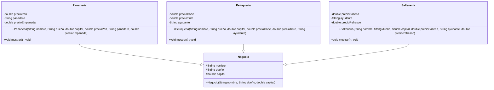

# Diagrama UML - Sistema de Negocios

## Descripción del Diagrama

### Clase Padre
- **Negocio**: Clase base con atributos comunes a todos los negocios

### Clases Hijas
- **Panaderia**: Especializada en productos de panadería
- **Peluqueria**: Especializada en servicios de belleza
- **Salteneria**: Especializada en venta de salteñas

### Relaciones
- Todas las clases hijas heredan de la clase `Negocio`
- Cada clase hija tiene sus propios atributos específicos
- Todas implementan el método `mostrar()` con su propia lógica
